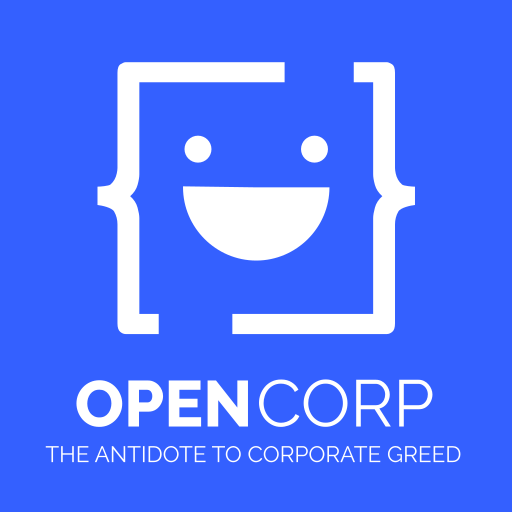
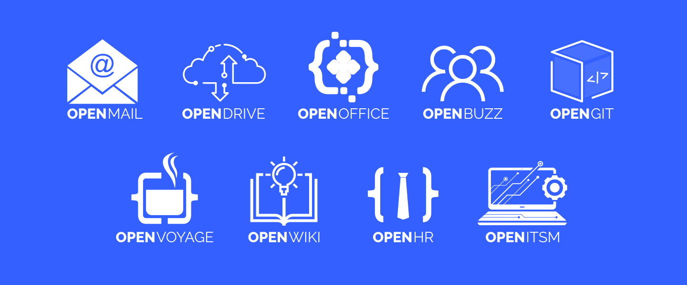

# OpenCorp



**OpenCorp** is a revolutionary open-source project designed to offer affordable alternatives to costly corporate software applications. Its primary objective is to furnish businesses and organizations with budget-friendly, secure, and feature-rich solutions. This comprehensive suite of products addresses a wide spectrum of corporate requirements, including corporate email services, robust file storage solutions, a versatile communication platform (encompassing text chats, voice and video calls, and virtual meetings), custom Git and Continuous Integration/Continuous Deployment (CI/CD) pipelines, a tailored Agile project management tool, a dedicated human resource management system, and specialized tech support tools. OpenCorp empowers enterprises to streamline their operations and reduce overheads while ensuring top-notch functionality and data security.



## Table of Contents

- [Products](#products)
- [Getting Started](#getting-started)
- [Documentation](#documentation)
- [Contributing](#contributing)
- [License](#license)

## Products

- **OpenMail**: Replace expensive email solutions with our secure and customizable email system. OpenMail is an open-source corporate email service that offers a range of features, including Advanced Antivirus and Security Filters, Calendar, and Notes. It provides a cost-effective and reliable solution for your organization's communication needs.

- **OpenDrive**: OpenDrive is an open-source file storage service that simplifies data management for your organization. It includes features like File Sharing and Cloud Sync, ensuring your files are easily accessible and shareable while maintaining data security.

- **OpenOffice**: OpenOffice is an open-source office suite that serves as a robust alternative to proprietary software like MS Office. It encompasses applications for word processing, spreadsheets, presentations, and more, allowing you to handle various office tasks efficiently.

- **OpenBuzz**: OpenBuzz is an open-source communication tool designed to replace platforms like MS Teams and Slack. It offers features such as Chat, Voice & Video Calls, Meetings, AI Meeting Notes, Channels, and more, facilitating seamless and collaborative communication within your organization.

- **OpenGit**: Host your own on-prem Git repositories with OpenGit, an open-source Git tool. It provides a comprehensive solution to replace services like Github Enterprise or Bitbucket Enterprise, offering capabilities such as Pull Requests and CI/CD Pipelines for efficient code management and collaboration.

- **OpenVoyage**: OpenVoyage is an open-source agile project management tool that replaces tools like JIRA or Trello. It helps your organization streamline project management, offering features tailored to agile methodologies and project tracking.

- **OpenWiki**: OpenWiki is an open-source wiki tool that serves as a substitute for Confluence. It allows your organization to create and manage collaborative documentation efficiently, enhancing knowledge sharing and information accessibility.

- **OpenHR**: OpenHR is an open-source human resource service that replaces platforms like Workday. It offers features for managing leaves, performance assessments, payroll, and more, streamlining HR processes within your organization.

- **OpenITSM**: OpenITSM is an open-source IT tech support tool equipped with features such as Ticket Management. It simplifies the management of IT support requests and helps ensure the efficient resolution of technical issues within your organization.


## Getting Started

These instructions will help you get a copy of the project up and running on your local machine or server.

### Prerequisites

[List any prerequisites, such as required software, hardware, or dependencies.]

### Installation

[Provide step-by-step installation instructions. Use code blocks if necessary.]

```bash
$ git clone https://github.com/OpenCorp-Foundation/OpenCorp.git
$ cd OpenCorp
$ [Add installation commands]
```
## Documentation

For detailed information on using and configuring **OpenCorp**, please refer to our [documentation](docs/).

## Contributing

We welcome contributions from the open-source community. If you'd like to contribute to the project, please follow these steps:

1. Fork the project repository.
2. Create a new branch for your feature or bug fix.
3. Make your changes and commit them with descriptive messages.
4. Push your changes to your fork.
5. Create a pull request to the main project repository.

For more information on contributing, please see our [Contribution Guidelines](CONTRIBUTING.md).

## License

This project is licensed under the MIT License - see the [LICENSE.md](LICENSE.md) file for details.

## Acknowledgments

[You can use this section to give credit to other open-source projects, libraries, or individuals that inspired or helped your project.]

---

**OpenCorp** is developed and maintained by OpenCorp Foundation. Feel free to [contact us](mailto:your-email@example.com) with any questions or feedback.

[Include badges, such as GitHub stars, forks, and license status here]

[Add any additional information or links as necessary]
